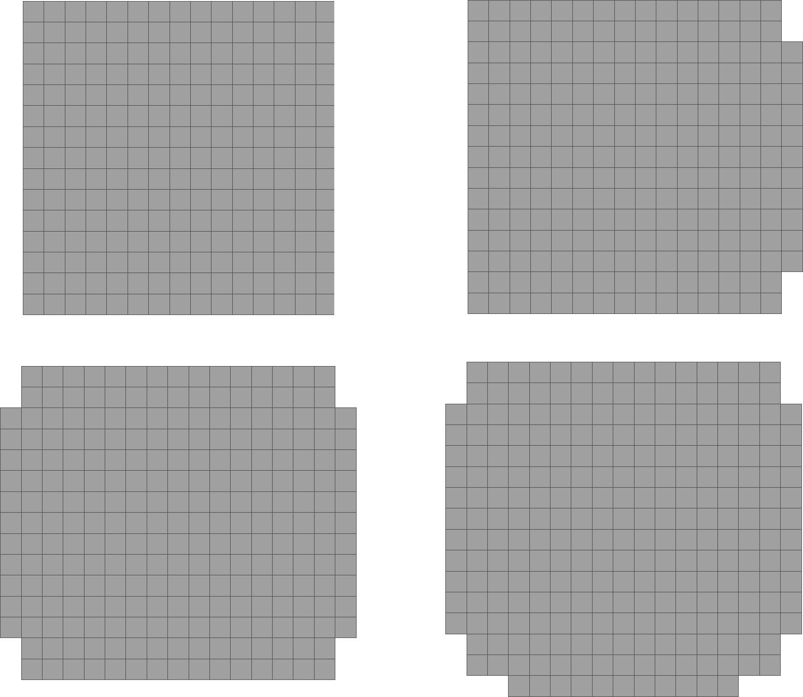

# Description

This package enumerates all g-glued curves of a shape and finds the
best n-combination with respect to some energy (squared curvature).




# Dependencies

1. [libboost1.66.0-dev](https://www.boost.org/users/history/version_1_66_0.html)
2. [opencv-3.3.0](https://opencv.org/releases.html)
3. [eigen-3.36](http://eigen.tuxfamily.org/index.php?title=Main_Page)
4. [DGtal0.9](https://dgtal.org/download/)


# Build and installation

```
mkdir build
cd build
cmake ..
make install
```

# Use

Check the pieces of code in lab/examples.
 